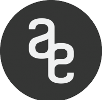

Introducción de la guía
=======================

Que puedes encontrar en esta guía
---------------------------------

En los próximos puntos encontrarás información relativa a las metodologías de trabajo realizadas
en delegación, información importante respesto a la estructura de los servicios disponibles tanto,
online como en la propia delegación a nivel interno.
Si encuentras algun fallo de escritura o de contenido por favor házmelo saber asi lo corrigo, también
son bien recibidas críticas o ideas que se pudieran ir incorporando en la guía para poder mejorarla y agregarle
mas valor a la misma.

Ideas futuras de la guía
------------------------

Algunas cosas que me gustaría implementar en esta guia son las siguientes:

* Tutoriales completos referentes a funcionamiento de distintos softwares y hardware disponible en delegación
* Elaboración de herramientas para automatizacion de tareas de gestion de la infraestructura de Delegación  y su completa documentación para futuros becarios.
* VideoTutoriales de servicios y herramientas. (Se aceptan colaboradores)
* Automatización de procesos repetitivos en Delegación.

Acerca de mí
------------
**Curso 2015 - 2016:**

+ Becario: Martin Collado. ETSI Sistemas Informáticos.

Soy Martin Collado, actual becario de mantenimiento web en Delegación Alumnos ETSAM.
Estudiante de Grado en Ing. Computadores de la Universidad Politecnica de Madrid.

**Contacto:** web@daetsam.es